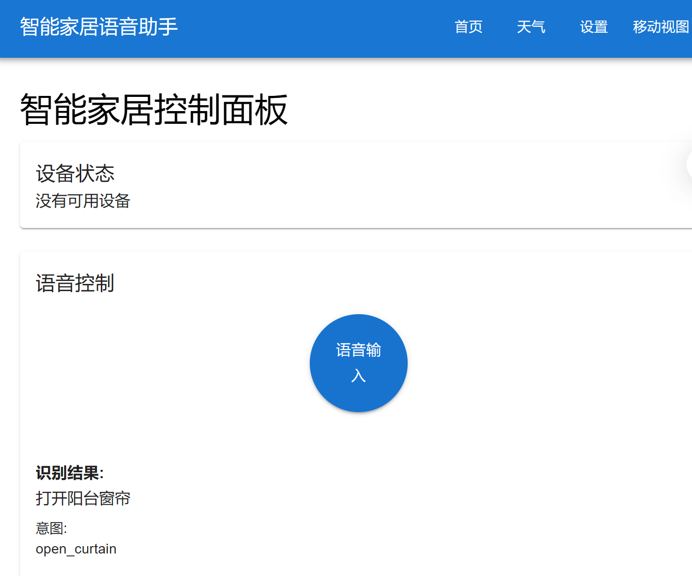

# UPDATELOG

## 5.17
* 写文档、画图的同学可以根据这些实时进度来理解代码结构：

#### 数据流
```
[前端]
   |
   | 语音/文本输入
   v
[Spring Boot 后端 Controller]
   |
   | 通过 HTTP 调用
   v
[nlp_service FastAPI 服务]
   |
   | 返回结构化结果（transcribed_text, nlu_result, tts_output_reference, ...）
   v
[Spring Boot 后端 Service]
   |
   | 设备控制/业务逻辑
   v
[前端]
   |
   | 显示结果/反馈
   v
[用户]
```

* 目前已完成的 - liuwj003：
#### NLP服务
* **STT**（speech_to_text）：能接受语音输入，使用whisper和dolphin两个引擎进行 **语音转文本** 的功能，**还未测试python代码的实际效果**，需要添加一些音频文件来测试
* 暂时打算：
  - 建议中文用户用dolphin引擎（考虑到更多的中文方言支持）
  - 建议英文用户用whisper引擎
* **NLU**（natural_language_understanding）：能**接受文本输入**，然后用一个被几十条**家居场景数据**微调过后的中文BERT模型进行意图识别，然后返回**识别出来的五个字段**（家居类型，家居编号（用户说的，比如客厅里的第2个灯的"2"），地点，动作，动作参数）
  - 可能考虑去掉"家居编号”这个字段，因为需要对“家具编号”和“动作参数”做区别，比较麻烦，优先级暂时没那么高，可能在后续的迭代加上
  - 用来微调的数据集（在`nlp_service/nlu/model/dataset/`）还不够好，我后续再改一下；微调模型的代码在`nlp_service/nlu/model/train/`目录下
  - 这个微调好的模型参数（放在`nlp_service/nlu/model/fine_tuned_nlu_bert/`目录下）由于有几百MB，所以不直接放在git上，我考虑后续放在hugging face上，这样用户第一次使用时就能从hugging face上下载这个模型
  - 意图识别还不够完善，目前只能识别很常见的动作、家居，我后续再改一下数据集和代码逻辑
* **TTS**（text_to_speech）：能接受文本输入，返回语音（女声男声可选），还没找，pyttsx3。
* 除了NLU模块是必要的，STT和TTS模块都是可选的，**用户可以选择不使用这两个模块（直接文本输入，不需要语音转文本的STT模块；不需要语音播报反馈，就不需要TTS模块）**
* 目前给前后端提供调用的都是placeholder引擎/处理器，仅供测试，后续会替换成实际的引擎/处理器（**等这个NLP服务模块内部测试完善后**）。

#### 前端
* 目前有一个大的网页界面，网页界面里可以看到手机端视图


* 但是，手机端只有这1个界面，还缺乏：
  - 手机端的设置界面
  - 适合老年人的大字设计界面
  - ...
* 大的网页界面也只有一些基本的组件，还需要后续设计与完善
* 目前的代码组织如下，需要前端的同学继续完善：
  - 主要在frontend/src下，完善各种网页组件、网页视图
```
frontend/
├── node_modules/      # 第三方依赖库，自动生成
├── public/            # 静态资源
│   ├── index.html     # 应用入口 HTML
│   └── manifest.json  # PWA 配置
├── src/               # 应用源代码
│   ├── components/    # 可复用 UI 组件
│   │   ├── Layout.js        # 整体布局
│   │   └── VoiceInput.js    # 语音输入核心
│   ├── pages/         # 页面级组件
│   │   ├── Home.js          # 主页
│   │   ├── PhoneView.js     # 手机视图/控制
│   │   ├── Settings.js      # 设置页
│   │   ├── Weather.js       # 天气页
│   │   └── 还需要手机设置页，手机天气页...等
│   ├── services/      # API 调用与服务
│   │   └── api.js         # 后端接口封装
│   ├── App.js           # 根组件 (路由、全局配置)
│   ├── index.css        # 全局样式
│   ├── index.js         # React 应用入口
│   └── MobileApp.css    # 移动端特定样式
├── package-lock.json  # 依赖版本锁定
├── package.json       # 项目配置与依赖
└── README.md          # 项目说明
```

#### 后端
* 
---

## 5.14-5.16 
* 重新梳理了语音服务逻辑，修改为nlp_service模块，tts与stt都应是可选的 - liuwj003 
目前的效果：


能成功保存设置了：

进一步确认了前后端的服务调用、连接，确保能调用提供的nlp_service：


微调了一个BERT-chinese，然后用微调好的模型实现了基本的NLU：


---

## 5.13
把后端重构成了spring-boot框架，实现正常的前后端连接，有了一个手机端视图，更好看了一点。-liuwj003


* 点击 移动视图，可以看到暂时的APP结果：


---
## 5.12
* 实现了基本的前后端连接、语音输入 - liuwj003


```
Prefix dict has been built successfully.
 * Serving Flask app 'app' (lazy loading)
 * Environment: production
   WARNING: This is a development server. Do not use it in a tion deployment.
   Use a production WSGI server instead.
 * Debug mode: on
 * Restarting with stat
Building prefix dict from the default dictionary ...
2025-05-12 17:15:27,627 - jieba - DEBUG - Building prefix dic the default dictionary ...
Loading model from cache 
Loading model cost 0.467 seconds.
2025-05-12 17:15:28,094 - jieba - DEBUG - Loading model cost 
seconds.
Prefix dict has been built successfully.
2025-05-12 17:15:28,094 - jieba - DEBUG - Prefix dict has beet successfully.
2025-05-12 17:15:28,370 - werkzeug - WARNING -  * Debugger ise!
2025-05-12 17:15:28,384 - werkzeug - INFO -  * Debugger PIN: 2-179
2025-05-12 17:15:30,327 - werkzeug - WARNING -  * Running on dresses.
   WARNING: This is a development server. Do not use it in a tion deployment.
2025-05-12 17:15:30,328 - werkzeug - INFO -  * Running on htt2.19.35.182:5000/ (Press CTRL+C to quit)
2025-05-12 17:18:29,965 - werkzeug - INFO - 127.0.0.1 - - [12/May/2025 
17:18:29] "GET /api/devices HTTP/1.1" 200 -
2025-05-12 17:18:30,232 - werkzeug - INFO - 127.0.0.1 - - [12/May/2025 
17:18:30] "GET /api/devices HTTP/1.1" 200 -
2025-05-12 17:18:58,038 - __main__ - INFO - 接收到语音命令请求
2025-05-12 17:18:58,039 - __main__ - INFO - 收到的音频文件类型: audio/webm, 文件名: recording.webm
2025-05-12 17:18:58,039 - __main__ - INFO - 返回模拟响应进行前端测试   
2025-05-12 17:18:58,040 - werkzeug - INFO - 127.0.0.1 - - [12/May/2025 
17:18:58] "POST /api/voice/command HTTP/1.1" 200 -
```

